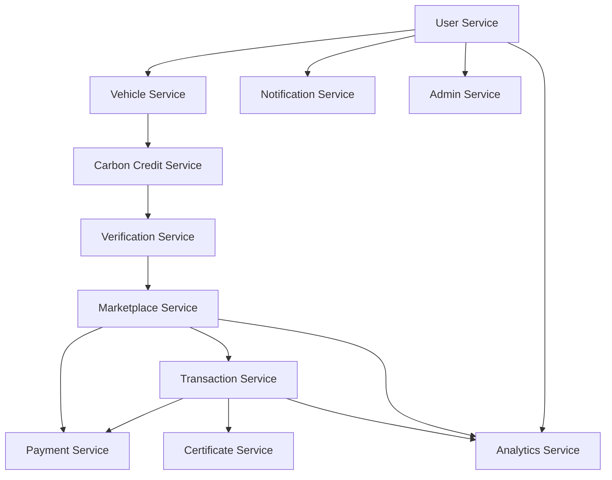

# Implementation Phases
## Carbon Credit Marketplace for EV Owners

**Version**: 1.0  
**Last Updated**: October 26, 2025  
**Total Duration**: 6-8 months  
**Team Size**: 8-10 developers

---

## Executive Summary

The implementation is divided into 4 strategic phases, each building upon the previous:
- **Phase 1**: Core Foundation (2 months)
- **Phase 2**: Marketplace Engine (1.5 months)  
- **Phase 3**: Financial & Compliance (1.5 months)
- **Phase 4**: Analytics & Enhancement (2-3 months)

---

## Phase 1: Core Foundation 🏗️
**Duration**: 8 weeks  
**Team**: 3 backend + 2 frontend + 1 DevOps  
**Goal**: Establish user ecosystem and carbon credit generation

### Services to Implement

#### 1.1 User Service (Week 1-2)
**Priority**: CRITICAL  
**Dependencies**: None  
**Effort**: 10 dev-days  

**Core Features**:
- User registration (email/phone/social)
- JWT authentication & refresh tokens
- Profile management
- KYC Level 1 workflow
- Password reset & 2FA
- Session management with Redis

**Database Tables**:
- users
- user_kyc_documents
- user_sessions
- user_2fa_secrets

**Success Criteria**:
- ✅ Registration completion < 2 minutes
- ✅ Login response < 500ms
- ✅ 2FA setup functional
- ✅ KYC documents upload working

#### 1.2 Vehicle Service (Week 3-4)
**Priority**: CRITICAL  
**Dependencies**: User Service  
**Effort**: 10 dev-days  

**Core Features**:
- Vehicle registration & verification
- VinFast/Tesla API OAuth integration
- Manual data upload (CSV/JSON)
- Trip data sync scheduler
- Data validation pipeline

**Database Tables**:
- vehicles
- trips (partitioned)
- trip_sync_jobs

**Success Criteria**:
- ✅ Vehicle registration < 1 minute
- ✅ API sync success rate > 98%
- ✅ Manual upload validation working
- ✅ Daily sync job running

#### 1.3 Carbon Credit Service (Week 5-6)
**Priority**: CRITICAL  
**Dependencies**: Vehicle Service  
**Effort**: 8 dev-days  

**Core Features**:
- CO₂ calculation engine
- Carbon credit wallet
- Credit balance management
- Verification request submission

**Database Tables**:
- carbon_credits
- credit_transactions
- verification_requests

**Success Criteria**:
- ✅ Calculation accuracy ±2%
- ✅ Wallet balance real-time updates
- ✅ Verification request creation working

#### 1.4 Notification Service (Week 7-8)
**Priority**: HIGH  
**Dependencies**: User Service  
**Effort**: 8 dev-days  

**Core Features**:
- Multi-channel notifications (email, SMS, in-app)
- Template management
- RabbitMQ integration
- Delivery tracking

**Database Tables**:
- notifications
- notification_templates

**Success Criteria**:
- ✅ Email delivery rate > 95%
- ✅ SMS delivery < 30 seconds
- ✅ In-app notifications real-time

### Phase 1 Deliverables
- ✅ User can register and complete KYC
- ✅ User can add vehicle and sync trips
- ✅ CO₂ savings calculated automatically
- ✅ Basic notification system operational

---

## Phase 2: Marketplace Engine 🛒
**Duration**: 6 weeks  
**Team**: 3 backend + 2 frontend + 1 QA  
**Goal**: Enable carbon credit trading

### Services to Implement

#### 2.1 Verification Service (Week 9-10)
**Priority**: CRITICAL  
**Dependencies**: Carbon Credit Service, User Service  
**Effort**: 10 dev-days  

**Core Features**:
- CVA auditor portal
- Verification queue management
- Data validation tools
- Credit issuance workflow
- Audit trail logging

**Database Tables**:
- verification_requests (enhanced)
- audit_logs (partitioned)

**Success Criteria**:
- ✅ Verification SLA < 48 hours
- ✅ Approval rate 85-95%
- ✅ Credits issued automatically
- ✅ Complete audit trail

#### 2.2 Marketplace Service (Week 11-13)
**Priority**: CRITICAL  
**Dependencies**: Carbon Credit Service, Verification Service  
**Effort**: 15 dev-days  

**Core Features**:
- Fixed price listings
- Auction engine with WebSocket
- Search with Elasticsearch
- Price recommendation (basic)
- Cart functionality
- Saved searches & watchlist

**Database Tables**:
- listings
- auction_bids
- saved_searches
- watchlist

**Success Criteria**:
- ✅ Search results < 2 seconds
- ✅ Real-time auction updates
- ✅ Listing creation < 30 seconds
- ✅ Cart reservation 30 minutes

#### 2.3 Admin Service (Basic) (Week 14)
**Priority**: HIGH  
**Dependencies**: All Phase 1 services  
**Effort**: 8 dev-days  

**Core Features**:
- User management
- KYC review & approval
- Basic dashboard
- Platform settings

**Database Tables**:
- admin_actions
- platform_settings

**Success Criteria**:
- ✅ Admin can manage users
- ✅ KYC review workflow functional
- ✅ Settings management working

### Phase 2 Deliverables
- ✅ CVA can verify carbon credits
- ✅ Users can create and browse listings
- ✅ Auction functionality working
- ✅ Basic admin portal operational

---

## Phase 3: Financial & Compliance 💳
**Duration**: 6 weeks  
**Team**: 3 backend + 2 frontend + 1 security expert  
**Goal**: Enable payments and certificate generation

### Services to Implement

#### 3.1 Payment Service (Week 15-17)
**Priority**: CRITICAL  
**Dependencies**: Marketplace Service  
**Effort**: 15 dev-days  

**Core Features**:
- MoMo integration
- VNPay integration
- Bank transfer with Napas
- Webhook handling
- Payment reconciliation

**Database Tables**:
- payments
- payment_webhooks

**Success Criteria**:
- ✅ Payment success rate > 98%
- ✅ Webhook processing < 5 seconds
- ✅ Reconciliation automated
- ✅ PCI-DSS compliant

#### 3.2 Transaction Service (Week 18-19)
**Priority**: CRITICAL  
**Dependencies**: Payment Service, Marketplace Service  
**Effort**: 10 dev-days  

**Core Features**:
- Transaction orchestration (Saga pattern)
- Escrow management
- Settlement processing
- Refund handling
- Transaction history

**Database Tables**:
- transactions
- escrow_accounts
- payouts

**Success Criteria**:
- ✅ Transaction completion < 3 minutes
- ✅ Escrow release T+2 days
- ✅ Refund processing < 7 days
- ✅ 100% transaction traceability

#### 3.3 Certificate Service (Week 20)
**Priority**: HIGH  
**Dependencies**: Transaction Service  
**Effort**: 8 dev-days  

**Core Features**:
- PDF certificate generation
- QR code generation
- Digital signature
- Public verification portal
- Certificate management

**Database Tables**:
- certificates
- certificate_verifications

**Success Criteria**:
- ✅ Certificate generation < 10 seconds
- ✅ QR verification working
- ✅ PDF quality professional
- ✅ Public portal accessible

### Phase 3 Deliverables
- ✅ Complete payment flow working
- ✅ Escrow and settlement functional
- ✅ Certificates automatically generated
- ✅ Public verification portal live

---

## Phase 4: Analytics & Enhancement 📊
**Duration**: 8-12 weeks  
**Team**: 2 backend + 2 frontend + 1 data engineer + 1 ML engineer  
**Goal**: Advanced features and optimization

### Services to Implement

#### 4.1 Analytics Service (Week 21-24)
**Priority**: HIGH  
**Dependencies**: All previous services  
**Effort**: 15 dev-days  

**Core Features**:
- Executive dashboard
- User analytics
- Marketplace analytics
- Report generation
- Data pipeline with TimescaleDB

**Database Tables**:
- analytics_* (multiple tables)
- materialized views

**Success Criteria**:
- ✅ Dashboard load < 5 seconds
- ✅ Real-time metrics (15 min delay)
- ✅ Report generation < 30 seconds
- ✅ Data retention 5 years

#### 4.2 Admin Service (Enhanced) (Week 25-26)
**Priority**: MEDIUM  
**Dependencies**: Analytics Service  
**Effort**: 10 dev-days  

**Enhanced Features**:
- Transaction monitoring
- Fraud detection (ML-based)
- Financial operations
- Support ticket system
- Content management

**Database Tables**:
- support_tickets
- fraud_alerts

**Success Criteria**:
- ✅ Real-time transaction feed
- ✅ Fraud detection accuracy > 95%
- ✅ Support SLA < 24 hours

#### 4.3 AI/ML Features (Week 27-30)
**Priority**: MEDIUM  
**Dependencies**: Analytics Service  
**Effort**: 20 dev-days  

**Features**:
- AI price recommendation model
- Fraud detection ML model
- Demand forecasting
- Anomaly detection in trip data
- Personalized recommendations

**Success Criteria**:
- ✅ Price recommendation MAPE < 15%
- ✅ Fraud detection precision > 90%
- ✅ Model refresh daily

#### 4.4 Mobile & PWA (Week 31-32)
**Priority**: MEDIUM  
**Dependencies**: All services  
**Effort**: 15 dev-days  

**Features**:
- Progressive Web App
- Offline mode
- Push notifications
- Mobile-optimized UI
- App store deployment (optional)

**Success Criteria**:
- ✅ PWA installable
- ✅ Offline functionality working
- ✅ Push notifications delivered
- ✅ Mobile performance score > 90

### Phase 4 Deliverables
- ✅ Comprehensive analytics dashboard
- ✅ ML-powered features operational
- ✅ Mobile app/PWA available
- ✅ Platform fully optimized

---

## Service Dependencies Matrix

---

## Risk Mitigation

### Technical Risks

| Risk | Impact | Mitigation |
|------|--------|------------|
| Payment gateway integration delays | HIGH | Start integration in Phase 2, use sandbox extensively |
| VinFast/Tesla API changes | MEDIUM | Abstract API layer, implement fallback to manual upload |
| Database performance issues | HIGH | Implement partitioning early, use read replicas |
| Security vulnerabilities | CRITICAL | Security audit after each phase, penetration testing |
| Elasticsearch complexity | MEDIUM | Start with PostgreSQL full-text, migrate later |

### Business Risks

| Risk | Impact | Mitigation |
|------|--------|------------|
| Regulatory changes | HIGH | Flexible calculation engine, configurable rules |
| Low user adoption | HIGH | MVP in Phase 2, gather feedback early |
| CVA bottleneck | MEDIUM | Automated validation tools, multiple CVA partners |
| Fraud attempts | HIGH | ML fraud detection, manual review queue |

---

## Success Metrics per Phase

### Phase 1 Metrics
- 500 registered users
- 100 vehicles connected
- 10,000 trips synced
- System uptime > 99%

### Phase 2 Metrics
- 50 listings created
- 10 successful transactions
- CVA processing < 48 hours
- Search response < 2 seconds

### Phase 3 Metrics
- 100 successful payments
- 100 certificates issued
- Payment success rate > 98%
- Zero security breaches

### Phase 4 Metrics
- 10,000 total users
- 500 corporate buyers
- 50B VND GMV
- Platform uptime > 99.5%

---

## Team Allocation

### Core Team Structure

**Phase 1 (6 people)**:
- 1 Tech Lead
- 3 Backend Developers (Java/Spring)
- 2 Frontend Developers (React/Next.js)

**Phase 2 (6 people)**:
- 3 Backend Developers
- 2 Frontend Developers
- 1 QA Engineer

**Phase 3 (6 people)**:
- 3 Backend Developers (payment expertise)
- 2 Frontend Developers
- 1 Security Expert

**Phase 4 (6 people)**:
- 2 Backend Developers
- 2 Frontend Developers
- 1 Data Engineer
- 1 ML Engineer

### Support Roles (Throughout)
- 1 DevOps Engineer
- 1 Product Manager
- 1 Business Analyst
- 1 UX/UI Designer

---

## Technology Stack by Phase

### Phase 1
- Spring Boot microservices setup
- PostgreSQL + Redis
- JWT authentication
- RabbitMQ messaging
- Docker containers

### Phase 2
- Elasticsearch integration
- WebSocket for real-time
- React state management
- API Gateway setup

### Phase 3
- Payment gateway SDKs
- PDF generation tools
- Security hardening
- PCI compliance

### Phase 4
- TimescaleDB for analytics
- ML frameworks (TensorFlow/scikit-learn)
- PWA implementation
- Performance optimization

---

## Go-Live Strategy

### Soft Launch (End of Phase 2)
- Limited beta with 100 users
- Manual payment processing
- Basic features only
- Gather feedback

### Public Beta (End of Phase 3)
- Open registration
- Full payment integration
- Marketing campaign
- 1,000 target users

### Full Launch (End of Phase 4)
- All features available
- 24/7 support
- International expansion ready
- 10,000+ users target

---

## Budget Estimation

### Development Costs

| Phase | Duration | Team Size | Cost (USD) |
|-------|----------|-----------|------------|
| Phase 1 | 2 months | 6 | $60,000 |
| Phase 2 | 1.5 months | 6 | $45,000 |
| Phase 3 | 1.5 months | 6 | $45,000 |
| Phase 4 | 2 months | 6 | $60,000 |
| **Total** | **7 months** | | **$210,000** |

### Infrastructure Costs (Monthly)

| Service | Cost (USD) |
|---------|------------|
| AWS (EC2, RDS, S3, etc.) | $2,000 |
| Payment Gateway Fees | $500 |
| Third-party APIs | $300 |
| Monitoring Tools | $200 |
| **Total** | **$3,000** |

---

**Document Version**: 1.0  
**Last Updated**: October 26, 2025  
**Next Review**: After Phase 1 completion
